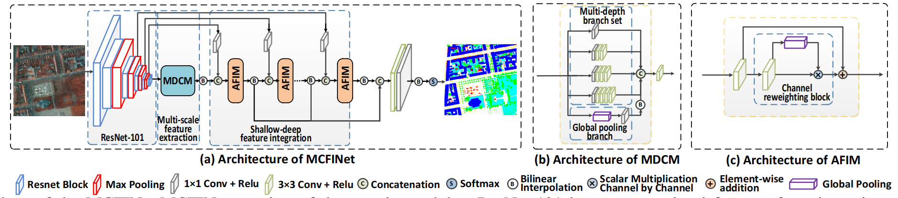
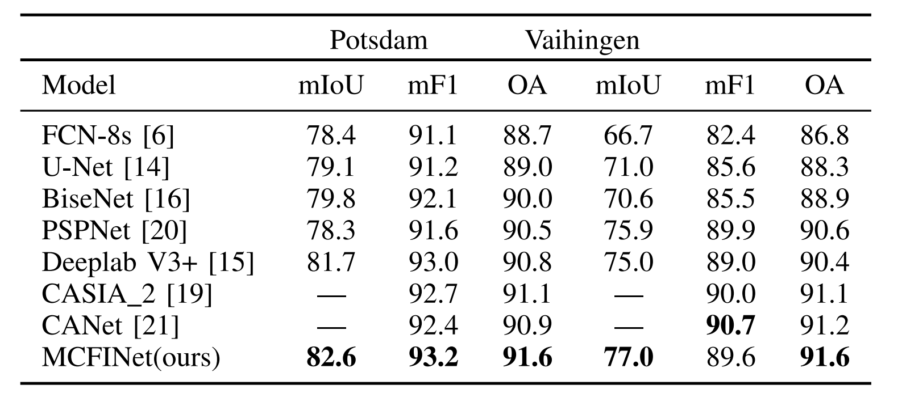

## [MCFINet: Multi-Depth Convolution Network with Shallow-Deep Feature Integration for Semantic Labeling in Remote Sensing Images](https://ieeexplore.ieee.org/document/9382793)

This is an implementation for this [paper](https://ieeexplore.ieee.org/document/9382793).


### Abstract

Semantic labeling in remote sensing images is an important and challenging technique, which has attracted increasing attention recently in earth detection, environmental protection, land utilization, and so on. However, it remains a challenge on how to effectively label objects with varied scales and similar textures in literature. Addressing this challenge, we propose a multidepth convolution network with shallow-deep feature integration, called MCFINet, which could effectively integrate multiscale contexts and shallow-layer/deep-layer features for labeling various objects. In the proposed network, we design two new modules--a multidepth convolutional module (MDCM) and an adaptive feature integration module (AFIM). The MDCM employs multilayer convolutions with varied layer numbers but fixed small-sized kernels in parallel to capture multiscale contexts, while the AFIM adaptively integrates the shallow-layer and deep-layer features of the proposed network to capture more discriminant features for segmenting objects with similar textures. Extensive experimental results on two benchmark data sets demonstrate that MCFINet could achieve better performances than seven existing methods in most cases.

### Datasets
Data could be download [here](https://www2.isprs.org/commissions/comm2/wg4/benchmark/2d-sem-label-vaihingen/).

### Evaluating
Evaluation tools could be download [here](https://pan.baidu.com/s/1x-GI5TgSt2nF2F9rnHp9lA):4cv3


### Training
Models could be trained by running:
  ```
  python train.py
  ```
### Testing
Models could be tested by running:
  ```
  python test.py
  ```



### Citation
If you find this project useful for your research, please cite this paper:
```
@ARTICLE{MCFINet2021,
author={Wang, Dongji and Dong, Qiulei},
journal={IEEE Geoscience and Remote Sensing Letters}, 
title={MCFINet: Multidepth Convolution Network With Shallow-Deep Feature Integration for Semantic Labeling in Remote Sensing Images}, 
year={2021},
volume={},
number={},
pages={1-5},
doi={10.1109/LGRS.2021.3065039}}
```

### Acknowledgement
This implementation refers to [repo1](https://github.com/yassouali/pytorch-segmentation) and [repo2](https://github.com/meetps/pytorch-semseg).

#